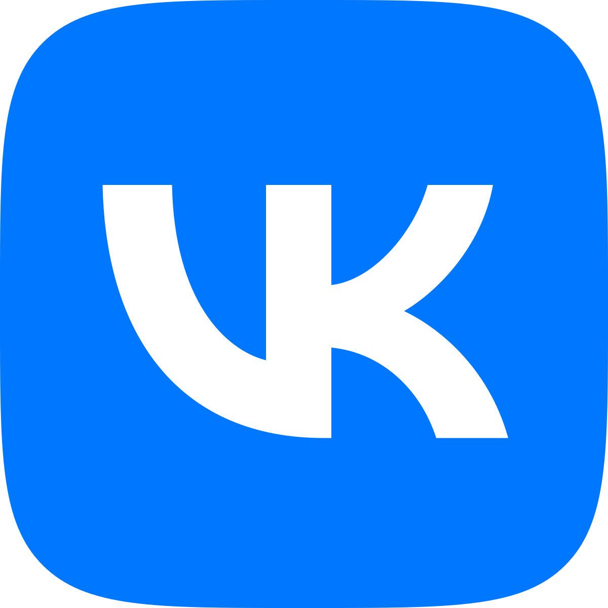
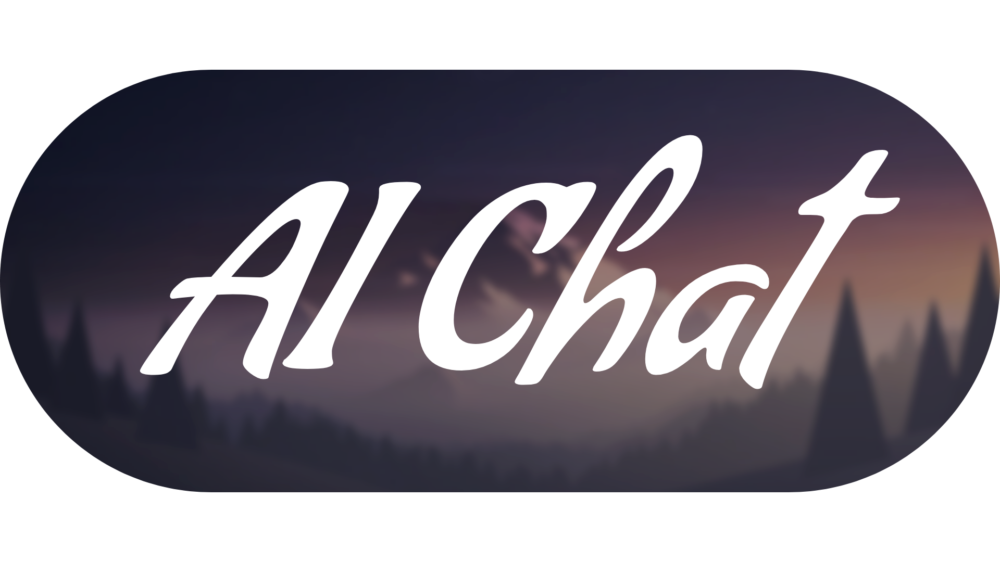
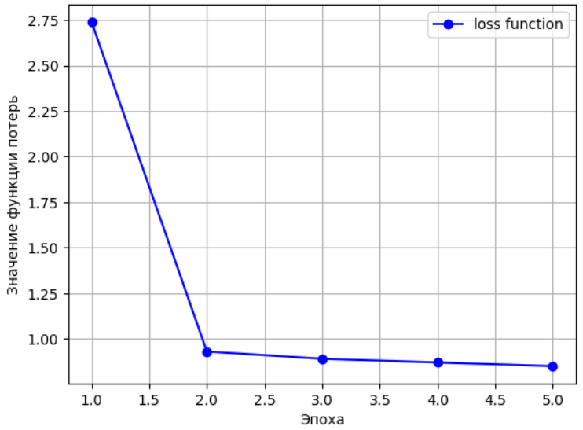
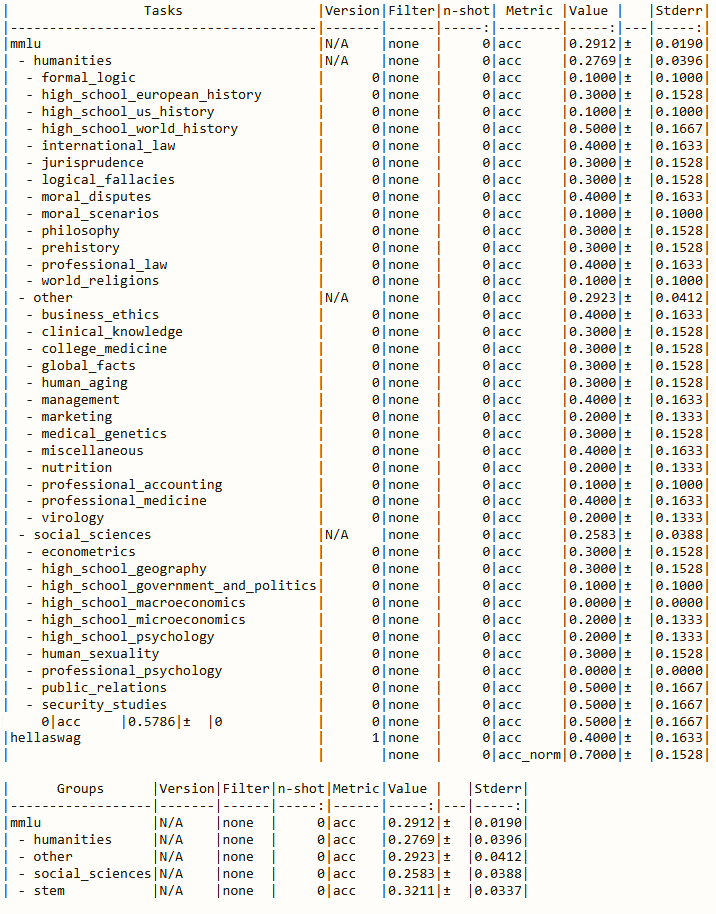
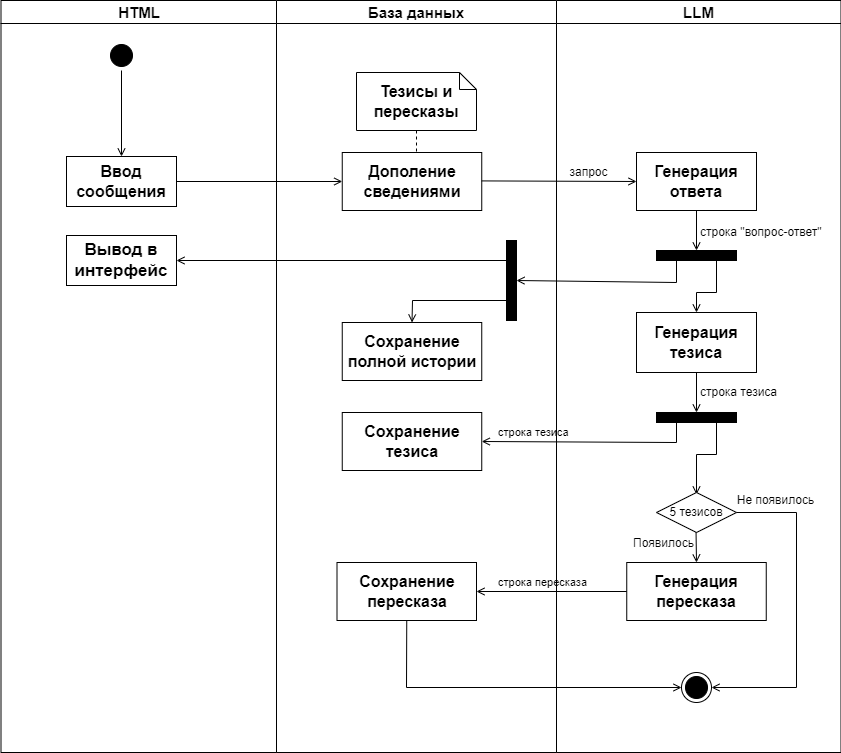

<div align="center">
<sup>Дипломный проект "NLP веб-приложение"</sup>
  
<sup>Намнанов Арсалан Батоевич, 2024</sup> <br />
<a href="https://t.me/Nars01">
  
</a>
<a href="https://vk.com/nars01_vk">
  
</a>
<a href="https://www.instagram.com/arsalan.namnanov">
  
</a>

<div></div>
<div><b>Чатбот "AI Chat"</b></div>

AI Chat — это чатбот, вдохновленный ChatGPT, с которым можно общаться на широкие темы,<br /> а также способный помнить давно прошедшие разговоры.

(Все описания моих проектов выполнены на английском. Этот — исключение.)

[Презентация](#презентация) •
[Технологии](#технологии) •
[Описание репозитория](#описание-репозитория)
</div>

## Презентация
https://github.com/user-attachments/assets/3243483d-4016-4436-b134-9d0569b45859

Приложение предлагает вести беседу с чатботом в удобном минималистичном интерфейсе.

## Технологии
Проект включал решение следующих задач:
1) Дообучение <a href="https://huggingface.co/tiiuae/falcon-7b"><u>LLM Falcon 7B</u></a>, на датасете <a href="https://huggingface.co/datasets/tatsu-lab/alpaca"><u>Alpaca</u></a> под общий домен методом <a href="https://arxiv.org/abs/2106.09685"><u>LoRA</u></a> при помощи фреймворка <a href="https://github.com/Lightning-AI/litgpt"><u>LitGPT</u></a>; <br />

<table align="center">
  <tr>
    <td></td>
    <td></td>
  </tr>
  <tr>
    <td align="center">Динамика функции ошибки по процесу обучения</td>
    <td align="center">Показатели тестирования на бенчмарках</td>
  </tr>
</table>

<br />
2) Написание <a href="https://flask.palletsprojects.com/en/stable/"><u>Flask</u></a> веб-приложения для чата с LLM с применением <a href="https://flask-sqlalchemy.readthedocs.io/"><u>ORM Flask-SQLAlchemy</u></a>; <br />
<table align="center">
  <tr>
    <td></td>
  </tr>
  <tr>
    <td align="center">Работа веб-приложения на диаграмме деятельности</td>
  </tr>
</table>

<br />
3) Деплой веб-приложения через Nginx, Gunicron, Flask.

## Описание репозитория
```
1. Repository Describtion:
   Here is the first part of NLP web-app project. Project consists of two parts:
   a. Flask web-app
      https://github.com/AKAD0/diploma_project (this repo)
   b. Finetuned model
      https://huggingface.co/AKAD0/falcon-7b-alpaca
   
2. Repository Branches:
   a. "master" - Base version of the Flask web-app.
      Independent. (Doesn't involve model)
   b. "inferenced" - Modified version of 'master' branch:
      Dependancies: library "litgpt[all]", model
   c. "memassist" - Modified version of 'inferenced' branch:
      1) "venv\Lib\site-packages\litgpt\deploy\serve.py" - customized 'decode_request()' to include 'input' field from JSON payload
      2) "app.py" - modified "button().response_json" variable to have 'input' field
   
3. 'master' Branch Installation:
   !!! path errors expected !!!
   Download the repo in root-folder.
